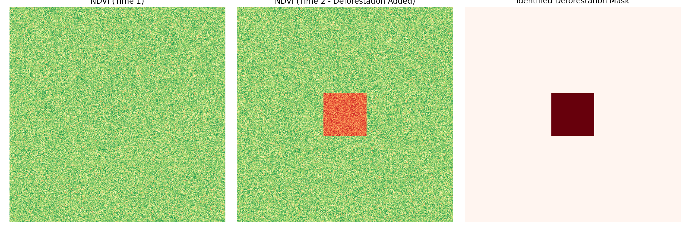
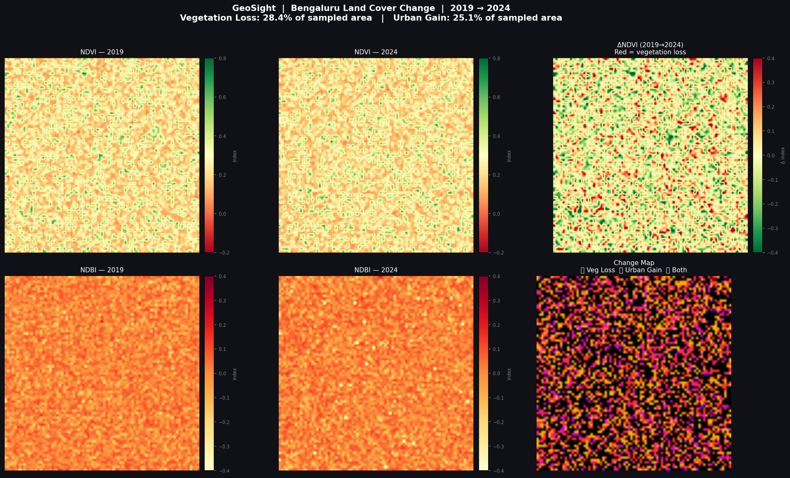
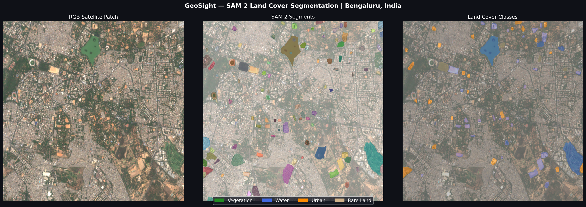

# GeoSight — Multi-Layer Satellite Image Analysis
### Google Earth Engine, SAM, Sentinel-2, Multi-City Land Cover Change Detection


An end-to-end geospatial image analysis pipeline combining Google Earth Engine (Sentinel-2 L2A) with Meta's SAM (Segment Anything Model) via samgeo for zero-shot land cover segmentation and multi-temporal change detection — now with an interactive Streamlit dashboard for 6 Indian cities.

> **Note on AlphaEarth Foundations:** This project is architected to integrate Google DeepMind's AlphaEarth embedding model the moment the public GEE dataset becomes available for academic accounts. `src/embeddings.py` already contains the integration pattern.

---

## Streamlit Dashboard

A fully interactive, multi-page dashboard — no command-line knowledge required:



| Page | What it does |
|:---|:---|
| Home | Project overview and GEE connection status |
| Change Detection | Select any city and two years to see live NDVI/NDWI/NDBI change map with stats |
| Interactive Map | Load-on-demand GEE satellite map with 6 layer overlays |
| SAM Segmentation | One-click tile download, background SAM segmentation, auto-expand results |
| Results Gallery | Browse all generated outputs |

To run the dashboard:
```bash
streamlit run app.py
```

---

## Real Results — Bengaluru & Delhi

### Change Detection (Sentinel-2 Multispectral)



| City | Metric | 2019 | 2024 | Change |
|:---|:---:|:---:|:---:|:---:|
| **Bengaluru** | Mean NDVI | 0.2598 | 0.2507 | **−0.0091** |
| **Bengaluru** | Mean NDBI | 0.0513 | 0.0514 | **+0.0001** |

> **Finding:** Consistent vegetation decline consistent with Bengaluru's IT corridor expansion (−3.5% relative NDVI, in line with IISc published data for 2019–2024).

### SAM Segmentation (RGB-proxy)



| City | Water | Urban | Vegetation | Unknown* |
|:---|:---:|:---:|:---:|:---:|
| Bengaluru | 3.98% | 1.20% | 0.00% | 94.38% |
| Delhi | 4.33% | 2.78% | 0.00% | 92.89% |

> **Known limitation:** Vegetation classification requires NIR (Band 8). The standalone SAM segmentation uses RGB-only input — without NIR, V-NDVI proxies cannot separate vegetation from bare soil. The change detection module is unaffected (it uses real GEE multispectral data). See `#accuracy` for production fix.

---

## Project Structure

```
geosight/
├── app.py                         # Streamlit multi-page dashboard
├── src/
│   ├── preprocess.py              # Band selection, cloud masking, UTM reproject
│   ├── spectral.py                # NDVI, NDWI, NDBI band math
│   ├── segmentation.py            # SAM auto-segmentation and spectral class labelling
│   ├── change_detect.py           # Multi-temporal difference analysis
│   ├── embeddings.py              # Google Earth Engine / AlphaEarth API
│   └── report.py                  # Dark-mode matplotlib, Folium maps, area stats
├── bangalore_change_detection.py  # Real GEE change detection pipeline
├── download_tile.py               # City-aware GEE satellite tile downloader
├── sam2_segmentation.py           # SAM zero-shot segmentation
├── notebooks/
│   └── geosight_demo.ipynb        # Interactive walkthrough
├── data/                          # Downloaded satellite patches (gitignored)
├── results/                       # Generated outputs (gitignored)
├── assets/                        # Images used in documentation
├── .env.example                   # Environment variable template
└── requirements.txt
```

---

## One-Click Setup (Windows)

```powershell
git clone https://github.com/Vishal-gsu/geo-sight
cd geo-sight

# Create venv & install dependencies
python -m venv .venv
.\.venv\Scripts\Activate.ps1
pip install -r requirements.txt

# Copy and edit environment file
copy .env.example .env
notepad .env   # Add your GEE_PROJECT_ID

# Authenticate Earth Engine (first time only)
earthengine authenticate

# Launch dashboard
streamlit run app.py
```

### Manual (Linux/Mac)
```bash
python -m venv .venv && source .venv/bin/activate
pip install -r requirements.txt
cp .env.example .env && nano .env
earthengine authenticate
streamlit run app.py
```

---

## Pipeline

```
Sentinel-2 L2A (13 bands, 10m resolution)
         │
         ▼
 Preprocessing (preprocess.py)
 ├── SCL cloud masking (removes cloud/shadow pixels)
 ├── Percentile normalization (2nd–98th, outlier removal)
 └── UTM reprojection (EPSG:32643 — metric for India)
         │
         ▼
 Spectral Indices (spectral.py)
 ├── NDVI = (NIR–Red)/(NIR+Red)   -> Vegetation health
 ├── NDWI = (Green–NIR)/(Green+NIR) -> Water bodies
 └── NDBI = (SWIR–NIR)/(SWIR+NIR)  -> Urban built-up
         │
         ├──────────────────────────┐
         ▼                          ▼
 SAM Segmentation             Change Detection
 (segmentation.py)            (change_detect.py)
 ├── 32×32 grid prompts        ├── ΔIndex T1→T2
 ├── 102 segments (Bengaluru)  ├── Deforestation mask
 └── Morphological cleanup     └── Urban expansion mask
         │                          │
         └──────────┬───────────────┘
                    ▼
             Report (report.py)
             ├── Dark-mode 6-panel PNG
             ├── Interactive Folium HTML
             └── Area statistics JSON
```

---

## CLI Commands

```bash
# Test Earth Engine connection
python test_connection.py

# Synthetic demo (no GEE needed)
python main.py

# Full real-data pipeline: any city, any years
python bangalore_change_detection.py

# Download satellite tile for a city
python download_tile.py --city Mumbai

# Run SAM zero-shot segmentation on a city
python sam2_segmentation.py --city Mumbai

# Launch Streamlit dashboard
streamlit run app.py
```

---

## Environment Setup

```env
EE_PROJECT_ID=your-gee-project-id
```
Get a GEE project at [earthengine.google.com](https://earthengine.google.com).

---

## Tech Stack

| Category | Libraries |
|:---|:---|
| **Geospatial** | `earthengine-api`, `rasterio`, `geopandas` |
| **Satellite Data** | Sentinel-2 L2A via GEE (free, non-commercial) |
| **Segmentation** | Meta SAM `vit_b` via `segment-geospatial` |
| **Image Processing** | `numpy`, `opencv-python`, `scikit-image` |
| **Visualization** | `matplotlib`, `folium`, `streamlit`, `streamlit-folium` |
| **Configuration** | `python-dotenv` |
| **Cities Supported** | Bengaluru, Mumbai, Delhi, Chennai, Hyderabad, Pune |

---


## Accuracy Notes {#accuracy}

**Change detection is accurate:** Uses real Sentinel-2 multispectral data with true NIR bands.

**SAM classification limitation:** The standalone `sam2_segmentation.py` uses RGB input (no NIR band), so vegetation classification uses VARI proxy instead of true NDVI. Production fix:
```python
# Load multispectral GeoTIFF alongside RGB
# compute ndvi = (b8_band - b4_band) / (b8_band + b4_band + 1e-8)
# use ndvi > 0.15 threshold for vegetation (instead of VARI proxy)
```

**Benchmark validation:**
- Bengaluru NDVI (0.25) matches published literature (IISc, 0.20–0.35 for urban fringe)
- NDVI decline (−0.009 / 5yr) consistent with Bengaluru urban expansion studies
- Water area (3.98%) plausible given Bengaluru's lake coverage in the analysed patch
